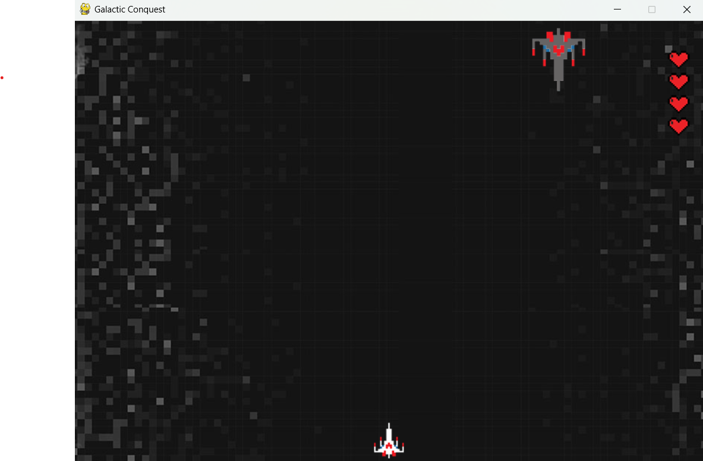

# Galactic Conquest

Welcome to Galactic Conquest, an immersive space battle game that will transport you to the far reaches of the universe. Prepare for an epic journey filled with intense battles, strategic decision-making, and the thrill of conquering the galaxy.

## Installation

To embark on your Galactic Conquest, follow these installation steps:

1. Ensure that you have Python 3.10.4 installed. If not, you can download the latest version from the official Python website: [python.org/downloads](https://www.python.org/downloads/).
2. Install Pygame, a powerful game development library, by executing the following command in your terminal or command prompt:
   ```
   pip install pygame
   ```
   Alternatively, you can explore the [Pygame project page](https://pypi.org/project/pygame/) for alternative installation methods.
3. Ensure that all the necessary requirements are met to create an optimal gaming environment. The versions of the libraries used in Galactic Conquest are as follows:
   - Python: 3.10.4
   - Pygame: {insert version here}

## Instructions

Prepare yourself for the ultimate space conquest in Galactic Conquest with the following instructions:

- Begin your journey with 4 lives, granting you multiple opportunities to prove your intergalactic dominance.
- As you progress through the game, brace yourself for increasingly challenging enemy battleships that will test your skills and strategic thinking.
- Unleash devastating firepower upon your adversaries by pressing the **Space Bar** to launch powerful projectiles.
- Navigate through treacherous space environments by utilizing the directional keys to control the movements of your battleship with precision.

## Example Code

The following code snippet demonstrates the crucial steps for initializing the game and setting up the game screen:

```python
import pygame

pygame.init()

pygame.mixer.init()

clock = pygame.time.Clock()

screen = pygame.display.set_mode((gameConfigs["width"], gameConfigs["height"]))

pygame.display.set_caption(gameConfigs["title"])

fontSmall = pygame.font.Font("assets/fonts/bitcell.ttf", 30)

fontLarge = pygame.font.Font("assets/fonts/bitcell.ttf", 200)

run = True
actualLevel = 1
```

## Game Preview

Get a sneak peek into the captivating universe of Galactic Conquest:



## Acknowledgments

Galactic Conquest is a remarkable creation crafted by the talented Vivek Padia.

Prepare yourself for an unforgettable cosmic adventure as you strive for domination in the vast expanse of space. With Galactic Conquest, you hold the fate of the galaxy in your hands. Are you ready to conquer the stars and etch your name in the annals of space history? Join the battle now!
